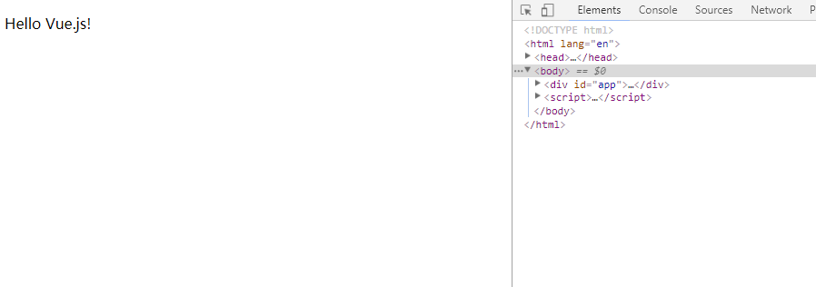
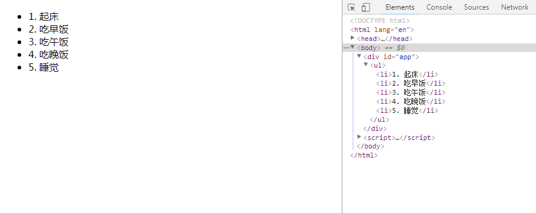

# Vue
个人学习记录

***

###  一、介绍

#### 1.简单的小应用

html:

	

  		
{{ msg }}

	

	   //引入vue

js:

	var app=new Vue({
  		el: '#app',
  		data: {
    		msg: 'Hello Vue.js!'
  		}
	})

	setTimeout('app._data.msg="Hi,I am Vue."',5000);   //皮一点

显示效果如下：

五秒后`
`内文本变为：Hi,I am Vue.  说明Vue是数据驱动的

#### 2.声明式渲染

> Vue.js 的核心是一个允许采用简洁的模板语法来声明式的将数据渲染进 DOM 的系统  

比如上面的例子，数据和 DOM 已经被绑定在一起，所有的元素都是响应式的，打开控制台或者在文件中输入`app.msg`即可获取`{{ msg }}`内的内容，并且可以通过`app.msg="xxx"`来动态修改

除了上述直接插入文本，还可以绑定DOM元素的属性  

html:

	

  		
    		鼠标悬停几秒钟查看此处动态绑定的提示信息！
  		
	

js:

    var app=new Vue({
        el:'#app',
        data:{
            msg:'页面加载于 ' + new Date().toLocaleString()
        }
    })

简言之，这里该指令(v-bind)的作用是：“将这个元素节点的 title 属性和 Vue 实例的 message 属性保持一致”

#### 3.条件与循环

设置一个元素的隐藏与显示

html:

	

  		
现在你看到我了

	

js:
	
    var app=new Vue({
        el:'#app',
        data:{
            seen:true
        }
    })

此时元素是可见的 如在控制台输入`app.seen=false`则隐藏该元素

这个例子演示了我们不仅可以绑定 DOM 文本到数据，也可以绑定 DOM 结构到数据。而且，Vue 也提供一个强大的过渡效果系统，可以在 Vue 插入/更新/删除元素时自动应用过渡效果(后面有)

`v-for` 指令可以绑定数组的数据来渲染一个项目列表  

html:

	

        <ul>
            <li v-for="todo in todos">{{ todo.text }}</li>
        </ul>
    

js:

	var app=new Vue({
        el:'#app',
        data:{
            todos:[{text:"1. 起床"},{text:"2. 吃早饭"},{text:"3. 吃午饭"},{text:"4. 吃晚饭"},{text:"5. 睡觉"}]
        }
    })

效果如下  
  
	
同样，也是数据驱动 比如我们在控制台输入`app.todos.push({text:"就知道吃和睡！"})`则为我们又增加了一个 `<li>就知道吃和睡！</li>`

#### 4.处理用户输入(事件)
用 v-on 指令绑定一个事件监听器，通过它调用我们 Vue 实例中定义的方法  

html:

	

    	<ul>
            
{{msg}}

            <button v-on:click="reverseMsg">点我翻转</button>
        </ul>
    

js:

    var app=new Vue({
        el:'#app',
        data:{
            msg:"我会被翻转，look me"
        },
        methods:{
            reverseMsg:function(){
                this.msg=this.msg.split('').reverse().join('');
            }
        }
    })

当点击按钮时，`
`内的文字就会被翻转   

注意this指向app  
注意方法作为methods对象的属性  
  

所有的 DOM 操作都由 Vue （底层，无需关心）来处理  

Vue 还提供了 v-model 指令，它能轻松实现表单输入和应用状态之间的双向绑定(输入与显示的双向绑定)  

html:

    

        <ul>
            
{{msg}}

            <input type="text" v-model="msg">
        </ul>
    
	

js:

    var app=new Vue({
        el:'#app',
        data:{
            msg:"双向绑定 ~"
        }   
    })	

v-model 指令，实现表单输入和应用状态之间的双向绑定,即输入与显示呈现相同的信息,而且改变是同步进行的

#### 5.组件化应用构建

> 组件系统是 Vue 的另一个重要概念，因为它是一种抽象，允许我们使用小型、独立和通常可复用的组件构建大型应用。仔细想想，几乎任意类型的应用界面都可以抽象为一个组件树

能将数据从父作用域传到子组件的一个应用  

html:

    

        <ol>
			<!-- 创建一个 todo-item 组件的实例-->
			    <!--
				现在我们为每个 todo-item 提供 todo 对象
      			todo 对象是变量，即其内容可以是动态的。我们也需
				要为每个组件提供一个“key”，晚些时候我们会做个解释。
    			-->
            <todo-item
                v-for="item in groceryList"
                v-bind:todo="item"
                v-bind:key="item.id">
            </todo-item>
        </ol>
    

js:

    Vue.component('todo-item', {      //定义名为 todo-item 的新组件
        props: ['todo'],              //props表示自定义属性集 todo为自定义的属性(名)
        template: '<li>{{ todo.text }}</li>'
    })
  
    var app = new Vue({
        el: '#app',
        data: {
            groceryList: [
                { id: 0, text: '蔬菜' },
                { id: 1, text: '奶酪' },
                { id: 2, text: '随便其他什么人吃的东西' }
            ]
        }
    })

我们已经设法将应用分割成了两个更小的单元，子单元通过 props 接口实现了与父单元很好的解耦。我们现在可以进一步为我们的 todo-item 组件实现更复杂的模板和逻辑的改进，而不会影响到父单元

假想的使用了组件的应用模板的样子

	

	  <app-nav></app-nav>
	  <app-view>
	    <app-sidebar></app-sidebar>
	    <app-content></app-content>
	  </app-view>
	

