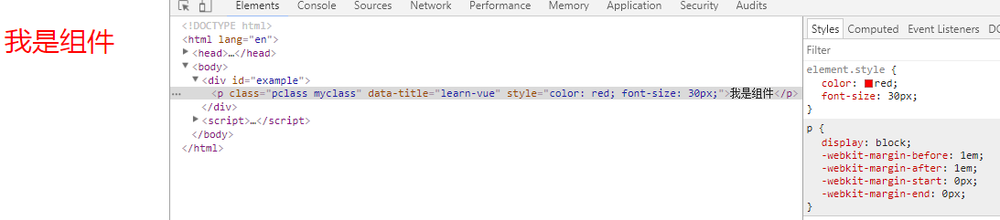

# 组件 (中)

### 非Prop特性

所谓非 prop 特性，就是指它可以直接传入组件，而不需要定义相应的 prop。

尽管为组件定义明确的 prop 是推荐的传参方式，组件的作者却并不总能预见到组件被使用的场景。所以，组件可以接收任意传入的特性，这些特性都会被添加到组件的根元素上。

例如:

html：

  	

    	<v-template data-title="learn-vue"></v-template>
  	

js:

	Vue.component('v-template',{
  		template:"
我是组件
"
	})
	var app=new Vue({
  		el: '#example',
  		data:{

  		}
	})

效果如图:  

可见，data-title 是非Prop特性，来自父组件，我们直接将它添加到了组件的根元素上并直接添加到组件上

#### 替换/合并现有的特性

html:

  	

    	<v-template data-title="learn-vue" class="myclass" style="color:red;font-size:30px;"></v-template>
  	

js:

	Vue.component('v-template',{
  		template:"
我是组件
"
	})
	var app=new Vue({
  		el: '#example',
  		data:{

  		}
	})

效果如图:  

class和style标签均来自父元素，我们都成功的加入到了组件内，而且添加的class属性和组件已有的class属性做了合并操作

### 自定义事件

我们知道，父组件使用 prop 传递数据给子组件。但子组件怎么跟父组件通信呢？这个时候 Vue 的自定义事件系统就派得上用场了。

即，前面介绍的都是父组件给子组件传递信息，这次我们介绍子组件给父组件传递信息

#### 使用v-on绑定自定义事件

每个 Vue 实例都实现了[事件接口](https://cn.vuejs.org/v2/api/#实例方法-事件)，即：

* 使用 $on(eventName) 监听事件
* 使用 $emit(eventName) 触发事件

父组件可以在使用子组件的地方直接用 v-on 来监听子组件触发的事件。  
注意：不能用 $on 侦听子组件释放的事件，而必须在模板里直接用 v-on 绑定，参见下面的例子。

例如:

html:

  	

    	
{{ total }}

    	<button-counter v-on:increment="incrementTotal"></button-counter>
    	<button-counter v-on:increment="incrementTotal"></button-counter>
	

js:

	Vue.component('button-counter', {
  		template: '<button v-on:click="incrementCounter">{{ counter }}</button>',
  		data: function () {
    		return {
      			counter: 0
    		}
  		},
  		methods: {
    		incrementCounter: function () {
      			this.counter += 1
      			this.$emit('increment')
    		}
  		},
	})

	var app=new Vue({
  		el: '#example',
  		data: {
    		total: 0
  		},
  		methods: {
    		incrementTotal: function () {
      			this.total += 1
    		}
  		}
	})

效果如下:  

在本例中，子组件已经和它外部完全解耦了。它所做的只是报告自己的内部事件，因为父组件可能会关心这些事件。请注意这一点很重要。

#### 给组件绑定原生事件

有时候，你可能想在某个组件的根元素上监听一个原生事件。可以使用 v-on 的修饰符 .native。  
例如：

	<my-component v-on:click.native="do.."></my-component>

#### .sync 修饰符

变化也会同步到父组件中所绑定的值。这很方便，但也会导致问题，因为它破坏了单向数据流。由于子组件改变 prop 的代码和普通的状态改动代码毫无区别，当光看子组件的代码时，你完全不知道它何时悄悄地改变了父组件的状态。这在 debug 复杂结构的应用时会带来很高的维护成本。但是 `.sync` 还是有其适用之处，比如在开发可复用的组件库时。我们需要做的只是让子组件改变父组件状态的代码更容易被区分。

`.sync` 只是作为一个编译时的语法糖存在。它会被扩展为一个自动更新父组件属性的 v-on 监听器。

如下代码

	<comp :foo.sync="bar"></comp>

会被扩展为：

	<comp :foo="bar" @update:foo="val => bar = val"></comp>

当子组件需要更新 foo 的值时，它需要显式地触发一个更新事件(我们在代码中手动去触发)：

	this.$emit('update:foo', newValue)

#### 使用自定义事件的表单输入组件

自定义事件可以用来创建自定义的表单输入组件，使用 v-model 来进行数据双向绑定。

v-model 其实是语法糖

	<input v-model="something">

这不过是以下示例的语法糖：

	<input
	  v-bind:value="something"
	  v-on:input="something = $event.target.value">

所以在组件中使用时，它相当于下面的简写：

	<custom-input
	  v-bind:value="something"
	  v-on:input="something = arguments[0]">
	</custom-input>

所以要让组件的 v-model 生效，它应该：

* 接受一个 value prop
* 在有新的值时触发 input 事件并将新值作为参数

例如，在子组件内的表单元素与父组件双向绑定

html:

  	

    	<custom-input :pass="myvalue" @in="change"></custom-input>
    	
{{ myvalue }}

	

js:

	Vue.component('custom-input', {
  		props:["pass"],
  		template: '<input type="text" @input="updata" :value="pass">',
  		methods:{
    		updata:function(e){
      			this.$emit("in",e.target.value);
    		}
  		}
	})

	var app=new Vue({
  		el: '#example',
  		data: {
    		myvalue: 0
  		},
  		methods:{
    		change:function(val){
      			this.myvalue=val;
    		}
  		}
	})

#### 自定义组件的 v-model

默认情况下，一个组件的 v-model 会使用 value prop 和 input 事件。但是诸如单选框、复选框之类的输入类型可能把 value 用作了别的目的。model 选项可以避免这样的冲突（自定义 v-model）：

js:

	Vue.component('my-checkbox', {
  		model: {
    		prop: 'checked',
    		event: 'change'
  		},
  		props: {
    		checked: Boolean,
    		// 这样就允许拿 `value` 这个 prop 做其它事了
    		value: String
  		},
  		// ...
	})

例如

	<my-checkbox v-model="foo" value="some value"></my-checkbox>

上述代码等价于：

	<my-checkbox
  		:checked="foo"
  		@change="val => { foo = val }"
  		value="some value">
	</my-checkbox>

#### 非父子组件的通信

有时候，非父子关系的两个组件之间也需要通信。在简单的场景下，可以使用一个空的 Vue 实例作为事件总线：

	var bus = new Vue()

触发组件 A 中的事件

	// 触发组件 A 中的事件
	bus.$emit('id-selected', 1)

在组件 B 创建的钩子中监听事件

	// 在组件 B 创建的钩子中监听事件
	bus.$on('id-selected', function (id) {
  		// ...
	})

在复杂的情况下，我们应该考虑使用专门的[状态管理模式](https://cn.vuejs.org/v2/guide/state-management.html)

