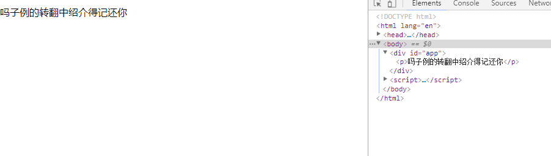

# 模板语法

Vue.js 使用了基于 HTML 的模板语法，允许开发者声明式地将 DOM 绑定至底层 Vue 实例的数据。所有 Vue.js 的模板都是合法的 HTML ，所以能被遵循规范的浏览器和 HTML 解析器解析。

> 在底层的实现上，Vue 将模板编译成虚拟 DOM 渲染函数。结合响应系统，在应用状态改变时，Vue 能够智能地计算出重新渲染组件的最小代价并应用到 DOM 操作上。

### 1.插值

#### (1)文本

数据绑定最常见的形式就是使用“Mustache”语法 (双大括号) 的文本插值：  

	Message: {{ msg }}

 `{{msg}}` 标签将会被替代为对应数据对象（实例的data属性）上 msg 属性的值。无论何时，绑定的数据对象上 msg 属性发生了改变，插值处的内容都会随着更新。

通过使用 `v-once` 指令，你也能执行一次性地插值，当数据改变时，插值处的内容不会更新。但请留心这会影响到该节点上所有的数据绑定：

	这个将不会改变: {{ msg }}

#### (2)原始 HTML

双大括号会将数据解释为普通文本，而非 HTML 代码。为了输出真正的 HTML，你需要使用 v-html 指令：  

html:
	
    

        
在这里渲染：

    

js:

	new Vue({
    	el:"#app",
    	data: {
      	rawHtml:'This should be red.'
    	}
	})

效果如下：  

注意：我们生成的``嵌套在html已存在的``内  

这个 span 的内容将会被替换成为属性值 rawHtml，直接作为 HTML——会忽略解析属性值中的数据绑定。注意，你不能使用 v-html 来复合局部模板，因为 Vue 不是基于字符串的模板引擎。

> 你的站点上动态渲染的任意 HTML 可能会非常危险，因为它很容易导致 XSS 攻击。请只对可信内容使用 HTML 插值，绝不要对用户提供的内容使用插值。

#### (3)特性

Mustache 语法(`{{ }}这样的语法`)不能作用在 HTML 特性(元素的属性)上，遇到这种情况应该使用 v-bind 指令：
  
html:

    

        
我的id会变

    

js:

	new Vue({
    	el:"#app",
    	data: {
        	dynamicId:'myId'
    	}
	})

效果如下：  

因为数据驱动，所以div的id属性可以动态修改

可通过设置布尔值来设置一个属性的显示(存在)与否  

html:

    

        

    

js:

	var app=new Vue({
    	el:"#app",
    	data: {
        	bull:true
    	}
	})	

如果 `bull `为true则显示 `

`  
如果 `bull` 为false则显示 `

`  隐藏掉了我们自定义的display属性   

不只是false 如果 `bull` 为 `null` 或 `undefined` 也能同样实现隐藏

#### (4)使用javascript表达式

迄今为止，在我们的模板中，我们一直都只绑定简单的属性键值。但实际上，对于所有的数据绑定，Vue.js 都提供了完全的 JavaScript 表达式支持。

html:

	

        
{{msg.split('').reverse().join('')}}

    

js:

	var app=new Vue({
    	el:"#app",
    	data: {
        	msg:"你还记得介绍中翻转的例子吗"
    	}
	})

效果如下:  

这样的表达式会在所属 Vue 实例的数据作用域下(虚拟 DOM 渲染函数 ?)作为 JavaScript 被解析。有个限制就是，每个绑定都只能包含单个表达式，所以下面的例子都不会生效。

	<!-- 这是语句，不是表达式 -->
	{{ var a = 1 }}

	<!-- 流控制也不会生效，请使用三元表达式 -->
	{{ if (ok) { return message } }}

注意：  
模板表达式都被放在沙盒中，只能访问全局变量的一个白名单，如 Math 和 Date 。你不应该在模板表达式中试图访问用户定义的全局变量。

### 2.指令

指令 (Directives) 是带有 v- 前缀的特殊属性。指令属性的值预期是单个 JavaScript 表达式 (v-for 是例外情况，稍后我们再讨论)。指令的职责是，当表达式的值改变时，将其产生的连带影响，响应式地作用于 DOM。回顾我们在介绍中看到的例子：  

	
现在你看到我了

这里，v-if 指令将根据表达式 seen 的值的真假来插入/移除 
 元素

#### (1)参数

一些指令能够接收一个“参数”，在指令名称之后以冒号表示。例如，v-bind 指令可以用于响应式地更新 HTML 属性：
	
	<a v-bind:href="url">...</a>

在这里 href 是参数，告知 v-bind 指令将该元素的 href 属性与表达式 url 的值绑定。

另一个例子是 v-on 指令，它用于监听 DOM 事件：

	<a v-on:click="doSomething">...</a>

在这里参数是监听的事件名

#### (2)修饰符

修饰符 (Modifiers) 是以半角句号(英文句号) `.` 指明的特殊后缀，用于指出一个指令应该以特殊方式绑定  

例如：  

	<form v-on:submit.prevent="onSubmit">...</form>

.prevent 修饰符告诉 v-on 指令对于触发的事件调用 event.preventDefault()

### 3.缩写

v- 前缀作为一种视觉提示，用来识别模板中 Vue 特定的特性。当你在使用 Vue.js 为现有标签添加动态行为  时，v- 前缀很有帮助，然而，对于一些频繁用到的指令来说，就会感到使用繁琐。同时，在构建由 Vue.js 管理所有模板的单页面应用程序 时，v- 前缀也变得没那么重要了。因此，Vue.js 为 v-bind 和 v-on 这两个最常用的指令，提供了特定简写：

#### (1)v-bind 缩写

	<!-- 完整语法 -->
	<a v-bind:href="url">...</a>

	<!-- 缩写 -->
	<a :href="url">...</a>

#### (2)v-on 缩写

	<!-- 完整语法 -->
	<a v-on:click="doSomething">...</a>

	<!-- 缩写 -->
	<a @click="doSomething">...</a>

它们看起来可能与普通的 HTML 略有不同，但 : 与 @ 对于特性名来说都是合法字符，在所有支持 Vue.js 的浏览器都能被正确地解析。而且，它们不会出现在最终渲染的标记中。缩写语法是完全可选的，但随着你更深入地了解它们的作用，你会庆幸拥有它们。

	
