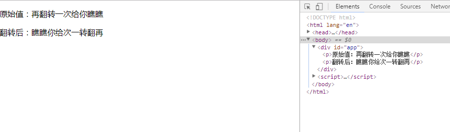
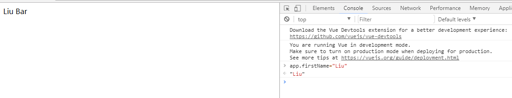
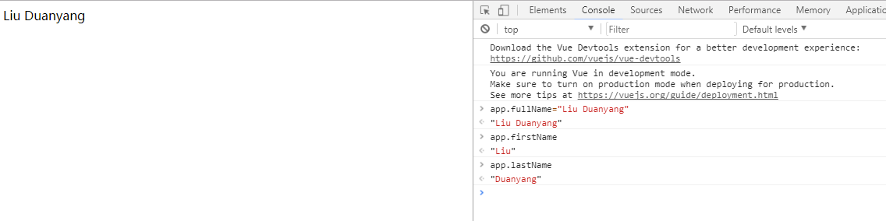

# 计算属性和观察者

***

### 1.计算属性

模板内的表达式(上一节 模板语法有介绍)非常便利，但是设计它们的初衷是用于简单运算的。在模板中放入太多的逻辑会让模板过重且难以维护。

	{{ message.split('').reverse().join('') }}

在这个地方，模板不再是简单的声明式逻辑。你必须看一段时间才能意识到，这里是想要显示变量 message 的翻转字符串。当你想要在模板中多次引用此处的翻转字符串时，就会更加难以处理。

所以，对于复杂的逻辑，应当使用计算属性

#### （1）基础例子

举个栗子

html:

    

        
原始值：{{msg}}

        
翻转后：{{reverseMsg}}

    

js:

	var app=new Vue({
    	el:"#app",
    	data: {
        	msg:"再翻转一次给你瞧瞧"
    	},
    	computed:{
        	reverseMsg:function(){
            	return this.msg.split('').reverse().join('');
        	}
    	}
	})	

效果如下:  

reverseMsg是我们声明的一个计算属性，我们声明的函数将作为属性reverseMsg的getter函数(属性的getter特性 每当访问该属性，调用这个函数)，计算属性的 getter 函数是没有副作用的，这使它更易于测试和理解。  

由于数据驱动，app.reversedMsg 的值始终取决于 app.msg 的值，试着在控制台改变 `app.msg` 的值，查看效果   

你可以像绑定普通属性一样在模板中绑定计算属性。Vue 知道 app.reverseMsg 依赖于 app.msg，因此当 app.msg 发生改变时，所有依赖 app.reverseMsg 的绑定也会更新。而且最妙的是我们已经以声明的方式创建了这种依赖关系

注意：计算属性可以实现复杂的逻辑，而不只是单单的表达式

#### （2）计算属性缓存vs方法

上述例子，我们可以通过方法调用达到同样的目的  

html:
	
    

        
原始值：{{msg}}

        
翻转后：{{reverseMsg()}}

    

js:

	var app=new Vue({
    	el:"#app",
    	data: {
        	msg:"再翻转一次给你瞧瞧"
    	},
    	methods:{
        	reverseMsg:function(){
            	return this.msg.split('').reverse().join('');
        	}
    	}
	})

效果是完全相同的  

那么，为什么要使用计算属性呢？  

计算属性是基于它们的依赖进行缓存的。  
计算属性只有在它的相关依赖发生改变时才会重新求值。这就意味着只要 msg 还没有发生改变，多次访问 reverseMsg 计算属性会立即返回之前的计算结果，而不必再次执行函数。

而，调用方法则  
每当触发重新渲染时，调用方法将总会再次执行函数  

我们为什么需要缓存？

假设我们有一个性能开销比较大的的计算属性 A，它需要遍历一个巨大的数组并做大量的计算。然后我们可能有其他的计算属性依赖于 A 。如果没有缓存，我们将不可避免的多次执行 A 的 getter！如果你不希望有缓存，请用方法来替代。  

#### （3）计算属性vs侦听属性

Vue 提供了一种更通用的方式来观察和响应 Vue 实例上的数据变动 即侦听属性(watch)。

当你有一些数据需要随着其它数据变动而变动时，你很容易滥用 watch。然而，通常更好的做法是使用计算属性而不是命令式的 watch 回调。

watch举个栗子：

html:

    

        {{ fullName }}
    

js:

	var app = new Vue({
   		el: '#app',
    	data: {
      		firstName: 'Foo',
      		lastName: 'Bar',
      		fullName: 'Foo Bar'
    	},
    	watch: {
      		firstName: function (val) {
        		this.fullName = val + ' ' + this.lastName
      		},
      		lastName: function (val) {
        		this.fullName = this.firstName + ' ' + val
      		}
    	}
  	})	

显示内容为：`Foo Bar`
  
watch属性中的firstName函数监听着data属性的firstName属性，当firstName属性发生变化时，及调用`{ }`定义的回调函数  
lastName同理

我们试图去修改firstName属性  
如图：  

已经成功修改

上述功能可以用计算属性来实现 而且似乎更好一些  

html:

    

        {{ fullName }}
    

js:

	var app = new Vue({
    	el: '#app',
    	data: {
      		firstName: 'Foo',
      		lastName: 'Bar'
    	},
    	computed: {
      		fullName: function () {
        		return this.firstName + ' ' + this.lastName
      		}
    	}
  	})

效果同上

#### （4）计算属性的setter

计算属性默认只有 getter ，不过在需要时你也可以提供一个 setter 

	// ...
	computed: {
  		fullName: {
    		// getter
    		get: function () {
      			return this.firstName + ' ' + this.lastName
    		},
    		// setter
    		set: function (newValue) {
      			var names = newValue.split(' ')
      			this.firstName = names[0]
      			this.lastName = names[names.length - 1]
    		}
 	 	}
	}
	// ...

现在再运行 app.fullName = 'Liu Duanyang' 时，setter 会被调用（每次对fullName更新时调用），app.firstName 和 app.lastName 也会相应地被更新

如图所示：  

### 2.侦听器

虽然计算属性在大多数情况下更合适，但有时也需要一个自定义的侦听器。这就是为什么 Vue 通过 watch 选项提供了一个更通用的方法，来响应数据的变化。当需要在数据变化时执行异步或开销较大的操作时，这个方式是最有用的。

例如(官网的demo)：

html:

	

  		

    		Ask a yes/no question:
    	<input v-model="question">
  		

  		
{{ answer }}

	

	<!-- 因为 AJAX 库和通用工具的生态已经相当丰富，Vue 核心代码没有重复 -->
	<!-- 提供这些功能以保持精简。这也可以让你自由选择自己更熟悉的工具。 -->
	script src="https://cdn.jsdelivr.net/npm/axios@0.12.0/dist/axios.min.js"></script>
	

js:

	var watchExampleVM = new Vue({
  		el: '#watch-example',
  		data: {
    		question: '',
    		answer: 'I cannot give you an answer until you ask a question!'
  		},
  		watch: {
    		// 如果 `question` 发生改变，这个函数就会运行
    		question: function (newQuestion) {
      			this.answer = 'Waiting for you to stop typing...'
      			this.getAnswer()
    		}
  		},
  		methods: {
    		// `_.debounce` 是一个通过 Lodash 限制操作频率的函数。
    		// 在这个例子中，我们希望限制访问 yesno.wtf/api 的频率
    		// AJAX 请求直到用户输入完毕才会发出。想要了解更多关于
    		// `_.debounce` 函数 (及其近亲 `_.throttle`) 的知识，
    		// 请参考：https://lodash.com/docs#debounce
   			 getAnswer: _.debounce(
      			function () {
        		if (this.question.indexOf('?') === -1) {
          			this.answer = 'Questions usually contain a question mark. ;-)'
          			return
       	 		}
        		this.answer = 'Thinking...'
        		var vm = this
        		axios.get('https://yesno.wtf/api')
          			.then(function (response) {
            			vm.answer = _.capitalize(response.data.answer)
          		})
          		.catch(function (error) {
            		vm.answer = 'Error! Could not reach the API. ' + error
          		})
      		},
      		// 这是我们为判定用户停止输入等待的毫秒数
      		500
    		)
  		}
	})

在这个示例中，使用 watch 选项允许我们执行异步操作 (访问一个 API)，限制我们执行该操作的频率，并在我们得到最终结果前，设置中间状态。这些都是计算属性无法做到的。
除了 watch 选项之外，您还可以使用命令式的 [vm.$watch API](https://cn.vuejs.org/v2/api/#vm-watch)

	
 