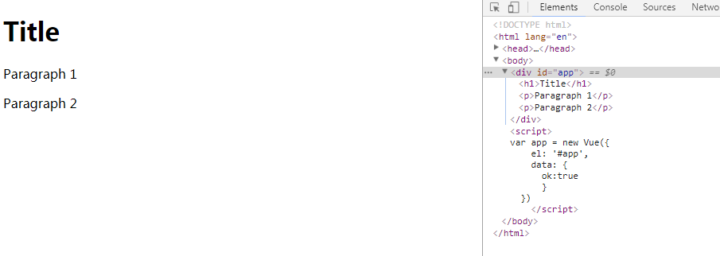
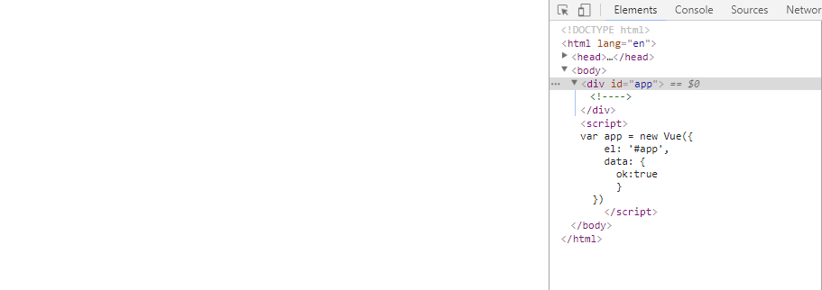
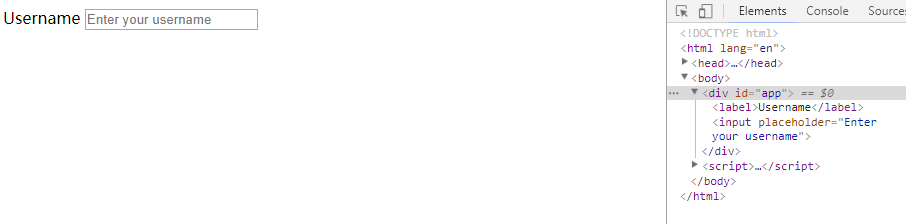
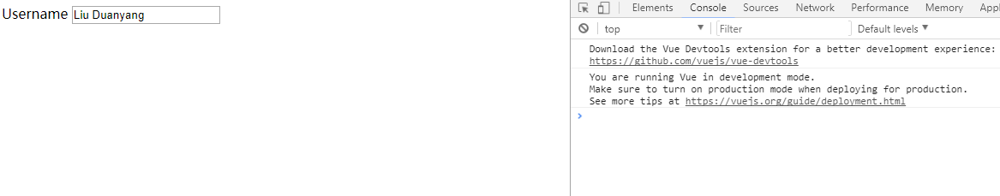
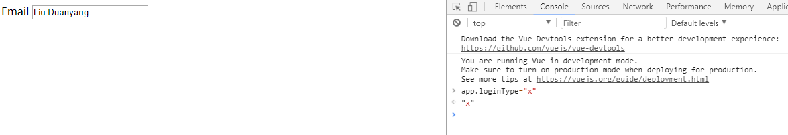
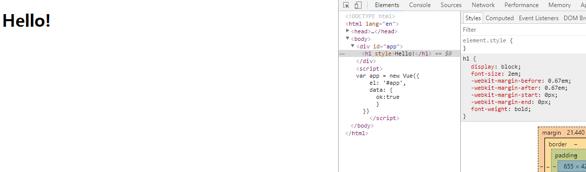
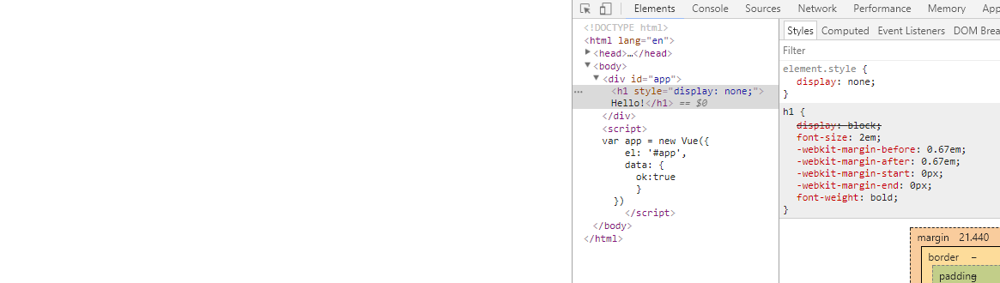

# 条件渲染

***

### 1.v-if

如果我们在一种模板引擎(字符串模板)中实现通过条件来控制元素的显示(渲染)与否，需要以下代码(例如在Handlebars 模板中)  

	<!-- Handlebars 模板 -->
	{{#if ok}}
  		<h1>Yes</h1>
	{{/if}}

相同的功能在 Vue 中，实现起来更简单  

html:

    

    	<h1 v-if="ok">Yes</h1>
  	

js:
	
	var app = new Vue({
    	el: '#app',
    	data: {
      		ok:true
	  	}
  	})

我们可通过改变 `app.ok`的值来控制元素是否渲染

我们也可以将v-if和v-else配合使用

html:

  	

    	<h1 v-if="ok">Yes</h1>
    	<h1 v-else>No</h1>
  	

js:

	var app = new Vue({
    	el: '#app',
    	data: {
      		ok:true
	  	}
  	})

当 `app.ok` 为真值时，仅渲染`<h1>Yes<h1>` 而不渲染`<h1>No</h1>`  
当 `app.ok` 不为真值时，仅渲染`<h1>No<h1>` 而不渲染`<h1>Yes</h1>`  

符合if else逻辑

#### （1）在`<template>`元素上使用v-if条件渲染分组

因为 v-if 是一个指令，所以必须将它添加到一个元素上。但是如果想切换多个元素呢？此时可以把一个 `<template>` 元素当做不可见的包裹元素，并在上面使用 v-if。最终的渲染结果将不包含 `<template>` 元素

例如

	<template v-if="ok">
  		<h1>Title</h1>
  		
Paragraph 1

  		
Paragraph 2

	</template>

当app.ok为真值时，如下  

当app.ok不为真值时，如下

#### （2）v-else

用法在上面已经介绍过了  

例如:

	
 0.5">
  		Now you see me
	

	

  		Now you don't
	

本例中就无需data属性了

注意:  
v-else 元素必须紧跟在带 v-if 或者 v-else-if 的元素的后面，否则它将不会被识别

#### （3）v-else-if

充当 v-if 的“else-if 块”，可以连续使用  

例如：

	

  		A
	

	

  		B
	

	

  		C
	

	

  		Not A/B/C
	

我们可通过实例中的data属性的type属性来控制显示哪些内容  

例如 `app.type='A'` 则显示`
A
`

类似于 v-else，v-else-if 也必须紧跟在带 v-if 或者 v-else-if 的元素之后

#### （4）用key管理可复用的元素

Vue 会尽可能高效地渲染元素，通常会复用已有元素（如果已有）而不是从头开始渲染。这么做除了使 Vue 变得非常快之外，还有其它一些好处。

例如，如果你允许用户在不同的登录方式之间切换，`<input>`元素不会被重新渲染，而是被复用，请看下面例子：

	<template v-if="loginType === 'username'">
  		<label>Username</label>
  		<input placeholder="Enter your username">
	</template>

	<template v-else>
  		<label>Email</label>
  		<input placeholder="Enter your email address">
	</template>

我们改变data中的loginType即可实现切换  

例如，改变前我们输入一些信息，如图所示：  
  
  

我们改变`app.loginType`，如图所示：  
  

说明input还是那个input，仅仅是替换了它的 placeholder 属性  

像上面的例子那样，是不符合实际需求的，所以 Vue 为你提供了一种方式来表达“这两个元素是完全独立的，不要复用它们”。只需添加一个具有唯一值的 key 属性即可

改进如下：

	<template v-if="loginType === 'username'">
  		<label>Username</label>
  		<input placeholder="Enter your username" key="username-input">
	</template>

	<template v-else>
  		<label>Email</label>
  		<input placeholder="Enter your email address" key="email-input">
	</template>

现在，每次切换时，输入框都将被重新渲染

注意，`<label>` 元素仍然会被高效地复用，因为它们没有添加 key 属性	

### 2.v-show

另一个用于根据条件展示元素的选项是 v-show 指令。和`v-if`用法大致一样

	<h1 v-show="ok">Hello!</h1>

注意：   
不同的是带有 v-show 的元素始终会被渲染并保留在 DOM 中。  
实际上v-show 只是简单地切换元素的 display CSS属性  

当ok为真值时，如图：  

此时，元素的display属性该是什么是什么

当ok不为真值时，如图：  
  
此时，元素的display属性为none  

注意，v-show 不支持 `<template>` 元素，也不支持 v-else  

### 3.v-if vs v-show

v-if 是“真正”的条件渲染，因为它会确保在切换过程中条件块内的事件监听器和子组件适当地被销毁和重建。

v-if 也是惰性的：如果在初始渲染时条件为假，则什么也不做——直到条件第一次变为真时，才会开始渲染条件块。

相比之下，v-show 就简单得多——不管初始条件是什么，元素总是会被渲染，并且只是简单地基于 CSS 进行切换。

一般来说，v-if 有更高的切换开销，而 v-show 有更高的初始渲染开销。因此，如果需要非常频繁地切换，则使用 v-show 较好；如果在运行时条件很少改变，则使用 v-if 较好。

### v-if 与 v-for 一起使用

当 v-if 与 v-for 一起使用时，v-for 具有比 v-if 更高的优先级，[查看详情](https://cn.vuejs.org/v2/guide/list.html#v-for-with-v-if)。

