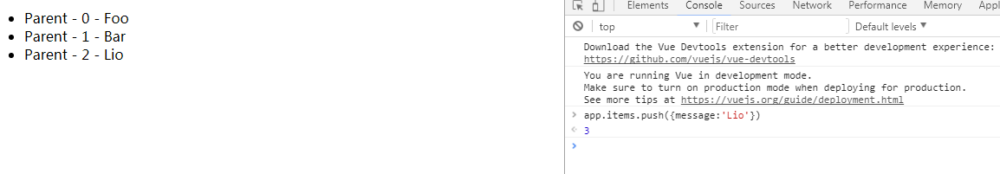
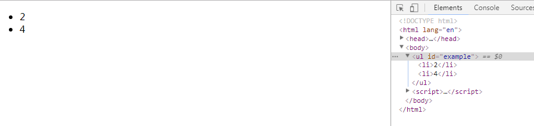
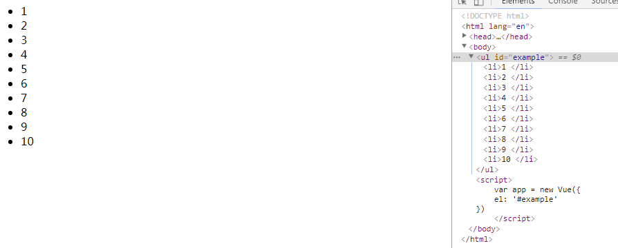

# 列表渲染

***

### 1. 用v-for把一个数组对应为一组元素

我们用 v-for 指令根据一组数组的选项列表进行渲染。v-for 指令需要使用 item in items 形式的特殊语法，items 是源数据数组并且 item 是数组元素迭代的别名。

html:

	<ul id="example-1">
	  	<li v-for="item in items">
	    	{{ item.message }}
  		</li>
	</ul>

js:

	var example1 = new Vue({
  		el: '#example-1',
  		data: {
    		items: [
      			{ message: 'Foo' },
      			{ message: 'Bar' }
    		]
  		}
	})

效果如下：  
  

在 v-for（作为 子 ） 块中，我们拥有对父（父为 example1 实例）作用域属性的完全访问权限。  
v-for 还支持一个可选的第二个参数为当前项的索引。

html:

  	<ul id="example-2">
    	<li v-for="(item, index) in items">
      		{{ parentMessage }} - {{ index }} - {{ item.message }}
    	</li>
  	</ul>

js:

	var example2 = new Vue({
  		el: '#example-2',
  		data: {
    		parentMessage: 'Parent',
    		items: [
      			{ message: 'Foo' },
      			{ message: 'Bar' }
    		]
  		}
	})

效果如下:  

你也可以用 of 替代 in 作为分隔符，因为它是最接近 JavaScript 迭代器的语法（js中常用for in 遍历对象 用for of遍历数组、字符串）

	

二者效果相同  

### 2. 一个对象的 v-for

可以用 v-for 迭代一个对象的属性(得到的是对应属性的属性值)  

html:

  	<ul id="v-for-object">
    	<li v-for="value in object">
      		{{ value }}
    	</li>
  	</ul>

js:

	new Vue({
  		el: '#v-for-object',
  		data: {
    		object: {
      			firstName: 'John',
      			lastName: 'Doe',
      			age: 30
    		}
  		}
	})

效果如下:  

可选的第二个参数表示属性名  
可选的第三个参数表示索引  

html:

	<ul id="v-for-object">
    	<li v-for="(value,key,index) in object">
    		{{ index }} - {{ key }} - {{ value }}
    	</li>
  	</ul>

js:

	new Vue({
  		el: '#v-for-object',
  		data: {
    		object: {
      			firstName: 'John',
      			lastName: 'Doe',
      			age: 30
    		}
  		}
	})

在遍历对象时，是按 Object.keys() 的结果遍历，但是不能保证它的结果在不同的 JavaScript 引擎下是一致的。

### 3. key

当 Vue.js 用 v-for 正在更新已渲染过的元素列表时，它默认用“就地复用”策略。如果数据项的顺序被改变，Vue 将不会移动 DOM 元素来匹配数据项的顺序， 而是简单复用此处每个元素，并且确保它在特定索引下显示已被渲染过的每个元素。

这个默认的模式是高效的，但是只适用于不依赖子组件状态或临时 DOM 状态 (例如：表单输入值) 的列表渲染输出。

为了给 Vue 一个提示，以便它能跟踪每个节点的身份，从而重用和重新排序现有元素，你需要为每项提供一个唯一 key 属性。理想的 key 值是每项都有的且唯一的 id。它的工作方式类似于一个属性，所以你需要用 v-bind 来绑定动态值 (本例中使用简写)  

	

  		<!-- 内容 -->
	

建议尽可能在使用 v-for 时提供 key，除非遍历输出的 DOM 内容非常简单，或者是刻意依赖默认行为以获取性能上的提升。

因为它是 Vue 识别节点的一个通用机制，key 并不与 v-for 特别关联，key 还具有其他用途，我们将在后面的指南中看到其他用途。

### 4. 数组更新检测

#### （1）变异方法
Vue 包含一组观察数组的变异(数组发生变化时)方法，所以它们也将会触发视图更新。这些方法如下：

* push()
* pop()
* shift()
* unshift()
* splice()
* sort()
* reverse()

即，当使用这些方法去操作items(data属性中的数组)时，也会触发视图更新

例如:  
html：

  	<ul id="example">
    	<li v-for="(item, index) in items">
        	{{ parentMessage }} - {{ index }} - {{ item.message }}
    	</li>
  	</ul>

js:

	var app = new Vue({
    	el: '#example',
    	data: {
      		parentMessage: 'Parent',
      		items: [
          		{ message: 'Foo' },
          		{ message: 'Bar' }
      		]
    	}
	})

此时，只有两个`<li>`元素，我们在控制台使用变异方法改变items数组，例如:  

  

#### （2）替换数组

变异方法 顾名思义，会改变被这些方法调用的原始数组。相比之下，也有非变异方法(不改变原始数组，返回一个新数组)，例如：filter(), concat() 和 slice() 。这些不会改变原始数组，但总是返回一个新数组。当使用非变异方法时，可以用新数组替换旧数组  

例如：

	example1.items = example1.items.filter(function (item) {
  		return item.message.match(/Foo/)
	})

你可能认为这将导致 Vue 丢弃现有 DOM 并重新渲染整个列表。幸运的是，事实并非如此。Vue 为了使得 DOM 元素得到最大范围的重用而实现了一些智能的、启发式的方法，所以用一个含有相同元素的数组去替换原来的数组是非常高效的操作。

#### （3）注意事项

由于 JavaScript 的限制，Vue 不能检测以下变动的数组：  

* 当你利用索引直接设置一个项时，例如：vm.items[indexOfItem] = newValue
* 当你修改数组的长度时，例如：vm.items.length = newLength

为了解决第一类问题，以下两种方式都可以实现和 vm.items

	[indexOfItem] = newValue 相同的效果，同时也将触发状态更新：
	// Vue.set
	Vue.set(example1.items, indexOfItem, newValue)

	// Array.prototype.splice
	example1.items.splice(indexOfItem, 1, newValue)

为了解决第二类问题，你可以使用 splice：

	example1.items.splice(newLength)

### 5. 对象更改检测注意事项

还是由于 JavaScript 的限制，Vue 不能检测对象属性的添加或删除：  

	var vm = new Vue({
  		data: {
    		a: 1
  		}
	})
	// `vm.a` 现在是响应式的

	vm.b = 2
	// `vm.b` 不是响应式的

对于已经创建的实例，Vue 不能动态添加根级别的响应式属性。但是，可以使用 Vue.set(object, key, value) 方法向嵌套对象添加响应式属性。

例如，对于：

	var vm = new Vue({
  		data: {
    		userProfile: {
      			name: 'Anika'
    		}
  		}
	})

你可以添加一个新的 age 属性到嵌套的 userProfile 对象

	Vue.set(vm.userProfile, 'age', 27)

你还可以使用 vm.$set 实例方法，它只是全局 Vue.set 的别名：

	this.$set(this.userProfile, 'age', 27)

有时你可能需要为已有对象赋予多个新属性，比如使用 [Object.assign](https://developer.mozilla.org/zh-CN/docs/Web/JavaScript/Reference/Global_Objects/Object/assign)() 或 _.extend()。在这种情况下，你应该用两个对象的属性创建一个新的对象，  

例如：  

	this.userProfile = Object.assign({}, this.userProfile, {
  		age: 27,
  		favoriteColor: 'Vue Green'
	})

上述代码表示，将三个对象合并起来并传递给实例的userProfile  

### 6. 显示过滤/排序结果

有时，我们想要显示一个数组的过滤或排序副本，而不实际改变或重置原始数据。在这种情况下，可以创建返回过滤或排序数组的计算属性

例如：

html:

  	<ul id="example">
    	<li v-for="n in evenNumbers">{{ n }}</li>
  	</ul>

js:

	var app = new Vue({
    	el: '#example',
    	data: {
      		numbers: [ 1, 2, 3, 4, 5 ]
    	},
    	computed: {
      		evenNumbers: function () {
        		return this.numbers.filter(function (number) {
          			return number % 2 === 0
        		})
      		}
    	}
	})

结果如图:  

在计算属性不适用的情况下,你也可以使用一个 method 方法：  

html:  

  	<ul id="example">
    	<li v-for="n in even(numbers)">{{ n }}</li>
  	</ul>

js:  

	var app = new Vue({
    	el: '#example',
    	data: {
      		numbers: [ 1, 2, 3, 4, 5 ]
    	},
    	methods: {
      		even: function (numbers) {
        		return numbers.filter(function (number) {
          			return number % 2 !== 0
        		})
      		}
    	}
	})

结果如图:  

### 7. 一段取值范围的 v-for

v-for 也可以取一段整数。在这种情况下，它将重复多次模板。

例如：

html:  

  	<ul id="example">
    	<li v-for="n in 10">{{ n }} </li>
  	</ul>

js:  

	var app = new Vue({
    	el: '#example'
	})

结果如图:  

### 8. v-for on a `<template>`

类似于 v-if，你也可以利用带有 v-for 的 <template> 渲染多个元素（即 每次循环都渲染一组元素），同样,`<template>`元素不可见

例如：  

html:

  	<ul id="example">
    	<template v-for="item in items">
      		<li>{{ item.msg }}</li>
      		<li class="divider">---</li>
    	</template>
  	</ul>

js:

	var app = new Vue({
    	el: '#example',
    	data:{
      		items:[{msg:'a'},{msg:'b'},{msg:'c'},{msg:'d'},{msg:'e'}]
    	}
	})

效果如下:  

### 9. v-for with v-if

当它们处于同一节点，v-for 的优先级比 v-if 更高，这意味着 v-if 将分别重复运行于每个 v-for 循环中。当你想为仅有的一些项（有条件的选择出一些项进行渲染）渲染节点时，这种优先级的机制会十分有用

例如：

	<li v-for="todo in todos" v-if="!todo.isComplete">
  		{{ todo }}
	</li>

上面的代码只传递了未 complete 的 todos中的项

而如果你的目的是有条件地跳过循环的执行（判断是否执行循环），那么可以将 v-if 置于外层元素 (或 `<template>`)上

	<ul v-if="todos.length">
  		<li v-for="todo in todos">
    		{{ todo }}
  		</li>
	</ul>
	
No todos left!

### 10. 一个组件的 v-for

在自定义组件里，你可以像任何普通元素一样用 v-for

	<my-component v-for="item in items" :key="item.id"></my-component>

注意：  
> 2.2.0+ 的版本里，当在组件中使用 v-for 时，key 现在是必须的

然而，任何数据都不会被自动传递到组件里，因为组件有自己独立的作用域。为了把迭代数据传递到组件里，我们要用 props(前面出现过，用于自定义属性，在这里传递信息的中转站)

[未完，待续](https://cn.vuejs.org/v2/guide/list.html#一个组件的-v-for)

