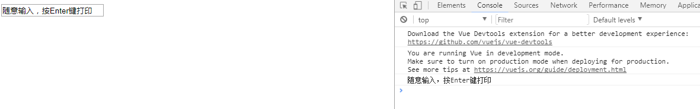

# 事件处理

***

### 1. 监听事件

可以用 v-on 指令监听 DOM 事件，并在触发时运行一些 JavaScript 代码

例如：

html:

  	

    	<button v-on:click="counter += 1">点我counter加一</button>
    	
按钮被点击 {{ counter }} 次.

  	

js:

	var app=new Vue({
  		el: '#example',
    	data: {
    		counter: 0
  		}
	})

每点击按钮一次，counter 自增一，并将结果通过`{{ counter }}`显示在`
`内

### 2. 事件处理方法

然而许多事件处理逻辑会更为复杂，所以直接把 JavaScript 代码写在 v-on 指令中是不可行的。因此 v-on 还可以接收一个需要调用的方法名称

例如：

html:

  	

    	<!-- `greet` 是在下面定义的方法名 -->
    	<button v-on:click="greet">Greet</button>
  	

js:

	var app = new Vue({
  		el: '#example',
  		data: {
    		name: 'Vue.js'
  		},
  		// 在 `methods` 对象中定义方法
  		methods: {
    		greet: function (event) {
      			// `this` 在方法里指向当前 Vue 实例
      			alert('Hello ' + this.name + '!')
      			// `event` 是原生 DOM 事件
      			if (event) {
        			alert(event.target.tagName)
      			}
    		}
  		}
	})

	// 也可以用 JavaScript 直接调用方法
	app.greet() // => 'Hello Vue.js!'

当点击按钮时，先弹出 "Hello Vue.js!"，然后弹出"BUTTON"

### 3. 内联处理器中的方法

除了直接绑定到一个方法，也可以在内联 JavaScript 语句中调用方法 (直接调用函数，并可传参)

例如:

html:

  	

    	<button v-on:click="say('hi')">弹出 hi</button>
    	<button v-on:click="say('what')">弹出 what</button>
  	

js：

	var app=new Vue({
  		el: '#example',
  		methods: {
    		say: function (message) {
      			alert(message)
    		}
  		}	
	})

点击第一个按钮，弹出 "hi"  
点击第二个按钮，弹出 "what"

有时也需要在内联语句处理器中访问原始的 DOM 事件。例如，可以用特殊变量 $event 把event对象传入方法，如果js语句为函数名则无需传入，只要回调函数的参数设置event(或e等等)即可，参考`2. 事件处理方法`中的例子。而在下例这种函数调用中实参形都要设置event(或e等等)

例如:

html：

  	

    	<button v-on:click="warn('Stop.', $event)">
  			Submit
		</button>
  	

js：

	var app=new Vue({
  		el: '#example',
  		methods: {
    		warn: function (message, event) {
      			// 现在我们可以访问原生事件对象
      			alert(message);
      			if (event){
        			alert(event.target.innerHTML);
      			}
    		}
  		}
	})

当点击按钮时，先弹出 "Stop." 然后弹出 "Submit"

# 4. 事件修饰符

理想的方式是：方法只有纯粹的数据逻辑，而不是去处理 DOM 事件细节。  
为了解决这个问题，Vue.js 为 v-on 提供了事件修饰符。之前提过，修饰符是由点开头的指令后缀来表示的。

诸如：

* .stop
* .prevent
* .capture
* .self
* .once

详细介绍：

	<!-- 阻止单击事件继续传播 -->
	

	<!-- 提交事件不再重载页面 -->
	<form v-on:submit.prevent="onSubmit"></form>

	<!-- 修饰符可以串联 -->
	

	<!-- 只有修饰符 -->
	<form v-on:submit.prevent></form>

	<!-- 添加事件监听器时使用事件捕获模式 -->
	<!-- 即内部元素触发的事件先在此处处理，然后才交由内部元素自身进行处理 -->
	
...

	<!-- 只当在 event.target 是当前元素自身时触发处理函数 -->
	<!-- 即事件不是从内部元素触发的 -->
	
...

	<!-- 点击事件将只会触发一次 -->
	<!-- 不像其它只能对原生的 DOM 事件起作用的修饰符，.once 修饰符还能被用到自定义的组件事件上 -->
	

注意：

> 使用修饰符时，顺序很重要；相应的代码会以同样的顺序产生。例如，用 @click.prevent.self (@click 为 v-on:click的简写) 会阻止所有的点击，而 @click.self.prevent 只会阻止对元素自身的点击。

### 5. 按键修饰符

在监听键盘事件时，我们经常需要检查常见的键值。Vue 允许为 v-on 在监听键盘事件时添加按键修饰符

	<!-- 只有在 `keyCode` 是 13 时调用 `vm.submit()` -->
	<input v-on:keyup.13="submit">

Vue 为最常用的按键提供了别名

Vue提供的全部的按键别名：

* .enter
* .tab
* .delete (捕获“删除”和“退格”键)
* .esc
* .space
* .up
* .down
* .left
* .right

应用示例:

	<input v-on:keyup.enter="submit">

	<!-- 缩写语法 -->
	<input @keyup.enter="submit">

我们也可以通过全局 [config.keyCodes](https://cn.vuejs.org/v2/api/#keyCodes) 对象自定义按键修饰符别名

	// 自定义按键修饰符别名"f1"
	Vue.config.keyCodes.f1 = 112

	//定义好后，应用示例：
	`v-on:keyup.f1`

一个小栗子:

html:

	

    	<input type="text" v-on:keyup.enter="cl" v-model="message" placeholder="说点什么吧...">
  	

js:

	var app=new Vue({
  		el: '#example',
  		data:{
    		message:""
  		},
  		methods:{
    		cl:function(){
      			console.log(this.message);
    		}	
  		}
	})

效果如下:  

#### （1）自动匹配按键修饰符

你也可直接将 KeyboardEvent.key 暴露的任意有效按键名转换为 kebab-case 来作为修饰符

	<input @keyup.page-down="onPageDown">

在上面的例子中，处理函数仅在 $event.key === 'PageDown' 时被调用

注意：  
有一些按键 (.esc 以及所有的方向键) 在 IE9 中有不同的 key 值, 如果你想支持 IE9，它们的内置别名应该是首选。

### 6. 系统修饰键

可以用如下修饰符来实现仅在按下相应按键时才触发鼠标或键盘事件的监听器

* .ctrl
* .alt
* .shift
* .meta

> 注意：在 Mac 系统键盘上，meta 对应 command 键 (⌘)。在 Windows 系统键盘 meta 对应 Windows 徽标键 (⊞)。在 Sun 操作系统键盘上，meta 对应实心宝石键 (◆)。在其他特定键盘上，尤其在 MIT 和 Lisp 机器的键盘、以及其后继产品，比如 Knight 键盘、space-cadet 键盘，meta 被标记为“META”。在 Symbolics 键盘上，meta 被标记为“META”或者“Meta”。

例如:

	<!-- Alt + C -->  按住Alt键并且释放C键(释放之前按住)才生效
	<input @keyup.alt.67="clear">

	<!-- Ctrl + Click -->  按住Ctrl键并点击鼠标才生效
	
Do something

	
	再举例
	v-on:keyup.alt.enter="xx" 按住Alt键并且释放enter键才有效

	v-on:click.c.ctrl="xx"    点击鼠标的同时必须同时按住c和ctrl键才有效

注意：  
请注意修饰键与常规按键不同，在和 keyup 事件一起用时，事件触发时修饰键必须处于按下状态。换句话说，只有在按住 ctrl 的情况下释放其它按键，才能触发keyup.ctrl。而单单释放 ctrl 也不会触发事件。

#### （1）`.exact` 修饰符

`.exact` 修饰符应与其他系统修饰符组合使用，以指示处理程序只在精确匹配该按键组合时触发

  	<!-- 即使 Alt 或 Shift 被一同按下时也会触发 -->
	<button @click.ctrl="onClick">A</button>
 
  	<!-- 仅在只有 Ctrl 被按下的时候触发 -->
	<button @click.ctrl.exact="onCtrlClick">A</button>

#### （2）鼠标按钮修饰符

* .left
* .right
* .middle

这些修饰符会限制处理函数仅响应特定的鼠标按钮

### 7. 为什么在HTML中监听事件？

你可能注意到这种事件监听的方式违背了关注点分离 (separation of concern) 这个长期以来的优良传统。但不必担心，因为所有的 Vue.js 事件处理方法和表达式都严格绑定在当前视图的 ViewModel 上，它不会导致任何维护上的困难。实际上，使用 v-on 有几个好处：
扫一眼 HTML 模板便能轻松定位在 JavaScript 代码里对应的方法。
因为你无须在 JavaScript 里手动绑定事件，你的 ViewModel 代码可以是非常纯粹的逻辑，和 DOM 完全解耦，更易于测试。
当一个 ViewModel 被销毁时，所有的事件处理器都会自动被删除。你无须担心如何自己清理它们。

