# 表单输入绑定

***

### 1. 基础用法

你可以用 v-model 指令在表单控件元素上创建双向数据绑定。它会根据控件类型自动选取正确的方法来更新元素。尽管有些神奇，但 v-model 本质上不过是语法糖，它负责监听用户的输入事件以更新数据，并特别处理一些极端的例子。

注意:
> v-model 会忽略所有表单元素的 value、checked、selected 特性的初始值。因为它会选择 Vue 实例数据来作为具体的值。你应该通过 JavaScript 在组件的 data 选项中声明初始值。

> 对于要求 IME (如中文、日语、韩语等) (IME 意为“输入法”)的语言，你会发现 v-model 不会在 ime 输入中得到更新。如果你也想实现更新，请使用 input 事件。

#### （1）文本

html:

  	

    	<input v-model="message" placeholder="在此输入...">
    	
Message is: {{ message }}

  	

js:

	var app=new Vue({
  		el: '#example',
  		data:{
    		message:""
  		}
	})

效果如图:  

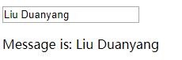

#### （2）多行文本

html:

  	

    	Multiline message is:
    	
{{ message }}

    	 
    	<textarea v-model="message" placeholder="add multiple lines"></textarea>
  	

js:

	var app=new Vue({
  		el: '#example',
  		data:{
    		message:""
  		}
	})

效果如图：  
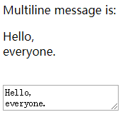

注意:  
在文本区域插值 (`<textarea></textarea>`) 并不会生效，应用 `v-model` 来代替

#### （3）复选框

栗子一:单个勾选框，显示逻辑值

html：

  	

    	<input type="checkbox" id="checkbox" v-model="checked">
    	<label for="checkbox">{{ checked }}</label>
  	

js:

	var app=new Vue({
  		el: '#example',
  		data:{
    		checked:!"false"  //这里是为了初始化能正常显示false,并且不勾选
  		}
	})

效果如下:  
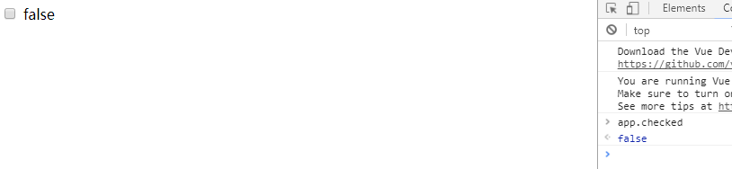  
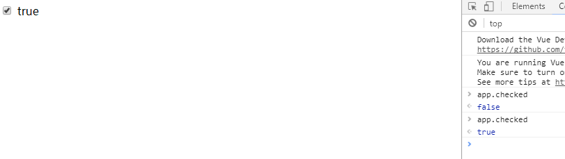  

栗子二:多个勾选框，绑定到同一个数组  

html:  

  	

    	<input type="checkbox" id="jack" value="Jack" v-model="checkedNames">
    	<label for="jack">Jack</label>
    	<input type="checkbox" id="john" value="John" v-model="checkedNames">
    	<label for="john">John</label>
    	<input type="checkbox" id="mike" value="Mike" v-model="checkedNames">
    	<label for="mike">Mike</label>
    	 
    	Checked names: {{ checkedNames }}
  	

js:

	var app=new Vue({
  		el: '#example',
  		data: {
    		checkedNames: []
  		}
	})

效果如图：  
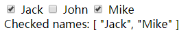

#### （4）单选按钮

html:

  	

    	
你最喜欢吃哪个菜?

    	<input type="radio" id="one" value="宫保鸡丁" v-model="picked">
    	<label for="one">宫保鸡丁</label>
    	 
    	<input type="radio" id="two" value="鱼香肉丝" v-model="picked">
    	<label for="two">鱼香肉丝</label>
    	 
    	Picked: {{ picked }}
  	

js:

	var app=new Vue({
  		el: '#example',
  		data: {
    		picked: ''
  		}
	})

效果如图:  
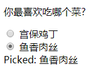  

本例中绑定的是元素的value值

#### （5）选择列表

1、单选列表:  

html:

  	

    	<select v-model="selected">
      		<option disabled value="">请选择</option>
      		<option>烤红薯</option>
      		<option>大鸡排</option>
      		<option>周黑鸭</option>
    	</select>
    	Selected: {{ selected }}
  	

js:

	var app=new Vue({
		el: '#example',
  		data: {
    		selected: ''
  		}
	})

效果如图:  
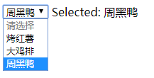

注意：  
如果 v-model 表达初始的值不匹配任何的选项，`<select>` 元素就会以”未选中”的状态渲染。在 iOS 中，这会使用户无法选择第一个选项，因为这样的情况下，iOS 不会引发 change 事件。因此，像以上提供 disabled 选项是建议的做法。

2、多选列表(绑定到一个数组)：  

html:

  	

    	<select v-model="selected" multiple>
      		<option>烤红薯</option>
      		<option>大鸡排</option>
      		<option>周黑鸭</option>
    	</select>
    	 
    	Selected: {{ selected }}
  	

js:

	var app=new Vue({
  		el: '#example',
  		data: {
    		selected: []
  		}
	})

效果如图：  
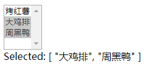

3、动态选项，用 `v-for` 渲染:

html:

  	

    	<select v-model="selected">
      		<option v-for="option in options" v-bind:value="option.value">
        		{{ option.text }}
      		</option>
    	</select>
    	Selected: {{ selected }}
  	

js:

	var app=new Vue({
  		el: '#example',
  		data: {
    		selected: 'A',
    		options: [
      			{ text: 'One', value: 'A' },
      			{ text: 'Two', value: 'B' },
      			{ text: 'Three', value: 'C' }
    		]
  		}
	})

效果如图:  
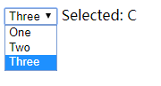  

对于单选按钮，勾选框及选择列表选项，v-model 绑定的 value 通常是静态字符串 (对于勾选框是逻辑值)

### 2. 值绑定

对于单选按钮，勾选框及选择列表选项，v-model 绑定的 value 通常是静态字符串 (对于勾选框是逻辑值)

例如:  

	<!-- 当选中时，`picked` 为字符串 "a" -->
	<input type="radio" v-model="picked" value="a">

	<!-- `toggle` 为 true 或 false -->
	<input type="checkbox" v-model="toggle">

	<!-- 当选中时，`selected` 为字符串 "abc" -->
	<select v-model="selected">
  		<option value="abc">ABC</option>
	</select>

但是有时我们想绑定 value 到 Vue 实例的一个动态属性上，这时可以用 v-bind 实现，并且这个属性的值可以不是字符串

#### （1）复选框

html:

  	

    	<input type="checkbox" v-model="toggle" v-bind:true-value="value1" v-bind:false-value="value2">
    	<label>复选框</label>
    	
{{ toggle }}

    	
{{ value1 }}

    	
{{ value2 }}

  	

js:

	var app=new Vue({
  		el: '#example',
  		data: {
    		toggle:false,
    		value1:'a',
    		value2:'b'
  		}
	})

效果如图：  
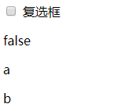  
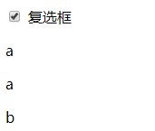  
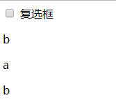  

即，初始时(未曾选中过)toggle值为false(初始化时设置的值)，选中后toggle的值为 `app.value1` 的值，未勾选(并非初始时)则为 `app.value2`的值

#### （2）单选按钮

html:

  	

    	<input type="radio" id="v1" v-model="picked" v-bind:value="value1">
    	<label for="v1">想吃东西</label>
    	<input type="radio" id="v2" v-model="picked" v-bind:value="value2">
    	<label for="v2">不想吃东西</label>
    	
{{ picked }}

    	
{{ value }}

  	

js:

	var app=new Vue({
  		el: '#example',
  		data: {
    		picked:false,
    		value1:123,
    		value2:456
  		}
	})

效果如图:  
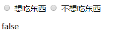  
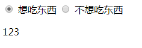  
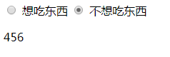  

即，选中哪个单选按钮 picked 的值就变成了相应的按钮的value的值

#### （3）选择框的选项（选择列表、下拉列表）

html:

  	

    	<select v-model="selected">
        	<option v-bind:value="{ number:123 }">123</option>
        	<option v-bind:value="{ number:456 }">456</option>
        	<option v-bind:value="{ number:789 }">789</option>
    	</select>
    	
{{ selected.number }}

  	

js:

	var app=new Vue({
  		el: '#example',
  		data: {
    		selected:''
  		}
	})

效果如图:  
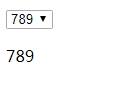  

选中哪个，selected的值就是对应选项的value的值，由于value的值都是对象，所以我们输出对象的number属性

可见，三种方式都是绑定了value属性的值

### 3. 修饰符

#### （1）.lazy

在默认情况下，v-model 在每次 input 事件触发后将输入框的值与数据进行同步 (除了上述输入法组合文字时)。你可以添加 lazy 修饰符，从而转变为使用 change 事件进行同步：

	<!-- 在“change”时而非“input”时更新 -->
	<input v-model.lazy="msg" >

即，当表单元素失去焦点或按下Enter键时才更新DOM

#### （2） .number

如果想自动将用户的输入值转为数值类型，可以给 v-model 添加 number 修饰符:

	<input v-model.number="age" type="number">

效果是，只允许用户输入数值类型的值  

这通常很有用，因为即使在 type="number" 时，HTML 输入元素的值也总会返回字符串

#### （3）.trim

如果要自动过滤用户输入的首尾空白字符，可以给 v-model 添加 trim 修饰符:

	<input v-model.trim="msg">

输入时，在输入内容的首尾的空格都会被去掉

### 4. 在组件上使用 v-model

HTML 原生的输入元素类型并不总能满足需求。幸好，Vue 的组件系统允许你创建具有完全自定义行为且可复用的输入组件。这些输入组件甚至可以和 v-model 一起使用！要了解更多，请参阅组件指南中的 [自定义输入组件](https://cn.vuejs.org/v2/guide/components.html#使用自定义事件的表单输入组件)